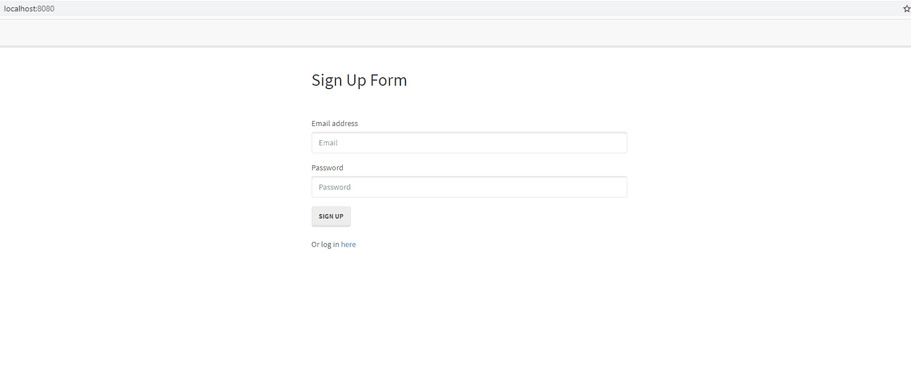

# Reverse-Engineering-Code

## About

This application is empowered, by using a middleware 'passport' npm package, with the ability to create a new user with the specific email and password. This instance of the user is saved in the database, and can be accessed when the user log-in with the same credentials. If any of the credentials does not match, the user is unable to log-in.

The tutorial below is to explain how the features seen in the deployed application was created and implemented. It is meant to be a high-level overview; for more specifics, please open the source files and there will be line-by-line comment explaining how and why the code works.

---

## Live Site



---


## Getting started
Below are the prerequisite understanding and programs that were utilized :
* Visual Studio Code-click [here](https://code.visualstudio.com/) to a tutorial to install
* Github repository-click [here](https://help.github.com/en/github/)
* node.js and its file system [here](https://nodejs.org/en/)
* bcrypt npm package [here](https://www.npmjs.com/package/bycrypt)
* express and express-session npm package[here](https://www.npmjs.com/package/express)
* mysql2 npm package[here](https://www.npmjs.com/package/mysql2)
* passport and passport-local npm package[here](https://www.npmjs.com/package/passport)
* sequelize npm package[here](https://www.npmjs.com/package/sequelize)

---

## Tutorial

##### Config folder

-middleware > isAuthenticated.js
-file contain a function that will be exported and be available globally; the function will perform the work to check if the user is logged-in and allow log-in users to have access to restricted routes

-config.json has a sequelize generated file that are used to create a path to the database

-passport.js requires the passport and passport-local npm packages, and the database generated in the 'models' folder; this file address the feature of creating a user validation using email, and checking all the different cases of sign-in. In the cases that the user enter an invalid email, a valid email but invalid password, correct email and password. The file exports the passport model to use.
```js
else if (!dbUser.validPassword(password))
```

---

##### Models folder

-index.js requires fs, path, the sequelize database and the cofiguration details in config.json. This file will generate a new instance of sequelize data for any of the files that exists within the 'models' folder. 

```js
fs
  .readdirSync(__dirname)
  .filter(function(file) {
    return (file.indexOf('.') !== 0) && (file !== basename) && (file.slice(-3) === '.js');
  })

  .forEach(function(file) {
    var model = sequelize['import'](path.join(__dirname, file));
    db[model.name] = model;
  });

```
-user.js require a bycrypt npm package. This file contains the instruction on how to create a new table with Sequelize. Speficially, this file has the instruction on how to create the user table with columns email and password. This file also has instruction on how to validate passwords, which is used in the passport.js file

```js
  User.prototype.validPassword = function(password) {
    return bcrypt.compareSync(password, this.password);
  };
```
---

##### Public folder
-The public folder contains all the client-side images and interactions

-js>login.js handles the event of submiting the log-in form with email and password as values.This file will grab the information, send it to the server with a POST api and then redirect the user to either a succesful route or not.

-js>members.js perform a GET request to the server for the information when the user sucessfully log-in

-js>signup.js is similar to the login.js but it handles the sign-up event 

-stylesheets folder contain the spefic styling elements that are on the user's browser

-the html files within this folder contains the specific id tags within the form that allow for the js files to grab the information that the user mention

---

##### Routes folder
-routes>api-routes.js requires the models folder and the passport file as described above. This file contains all the routes that the user may use and generating a response. There are 2 post routes corresponding to the log-in and sign-up feature, 2 get routes related to the user logging out of the session and when the user login to a session.

-routes>html-routes.js contains the routes that redirect the user to different landing pages base on if they are signing up or loging in.

---

##### server.js

-This file require express, express-session npm packages, and the passport model that was described above.

-The file set up the port environment and create an instance of express, and also syncing the database
```js
db.sequelize.sync().then(function() {
  app.listen(PORT, function() {
    console.log("==> 🌎  Listening on port %s. Visit http://localhost:%s/ in your browser.", PORT, PORT);
  });
});

```

---

## Author

**Mai Banh**
- [Link to Github](https://github.com/mtbanh)
- [Link to LinkedIn](https://www.linkedin.com/in/mai-banh-311ba6164/)

See also the list of [contributors](https://github.com/your/project/contributors) who participated in this project.
